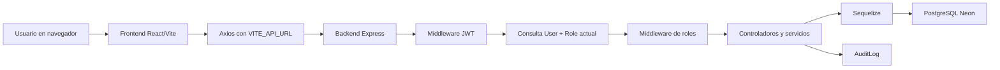

# Arquitectura de Seguridad

SISIA Cloud separa la interfaz, la API y la persistencia. El frontend React consume una API REST protegida por JWT. El backend Express valida solicitudes, consulta el usuario vigente en PostgreSQL, aplica permisos por rol y registra auditoría de acciones relevantes.

## Componentes

- Navegador: ejecuta React, guarda el token en `localStorage` y consume `VITE_API_URL`.
- Frontend: rutas protegidas, menú por rol, formularios y mensajes funcionales.
- Backend: autenticación, autorización, validaciones, reglas de negocio y auditoría.
- Sequelize: modelos y asociaciones para usuarios, roles, incidentes, activos, riesgos, controles y auditoría.
- PostgreSQL: persistencia principal mediante `DATABASE_URL`.
- Render: hosting HTTPS del backend y frontend.
- Neon: PostgreSQL cloud con SSL.

## Flujo Principal

## Decisiones de Seguridad

- El rol del JWT no se toma como fuente de verdad; se consulta la base de datos en cada ruta protegida.
- `tokenVersion` permite invalidar sesiones al cambiar contraseña, rol, estado o cerrar sesión.
- `status` permite eliminación lógica y evita borrados físicos en módulos de negocio.
- CORS usa `ALLOWED_ORIGINS` o `FRONTEND_URL`, sin comodines.
- Las variables sensibles viven en `.env` local o en variables de Render.

## Relaciones Base

- Un `User` pertenece a un `Role`.
- Un `Incident` tiene creador y puede tener responsable.
- Un `Risk` pertenece a un `Asset`.
- Un `Control` pertenece a un `Risk`.
- Un `AuditLog` puede asociarse al usuario que ejecutó la acción.

## Preparación para Producción

En producción se requiere `NODE_ENV=production`, `DATABASE_URL`, `JWT_SECRET` fuerte, `FRONTEND_URL` y `ALLOWED_ORIGINS`. Render provee HTTPS y Neon provee conexión PostgreSQL con SSL.
